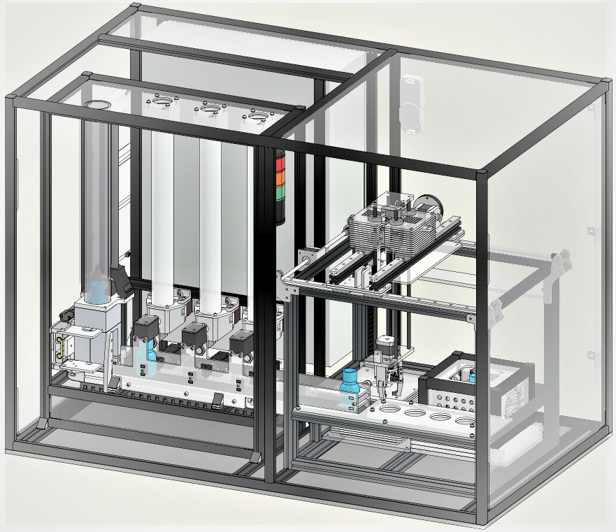
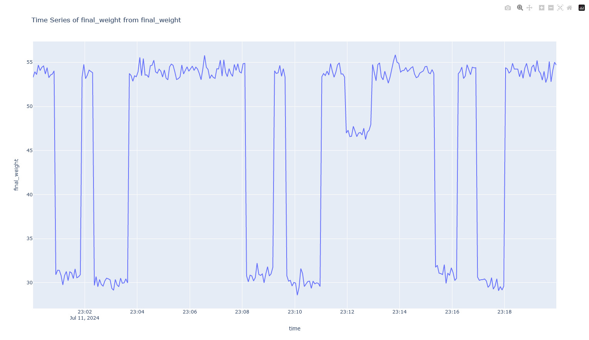
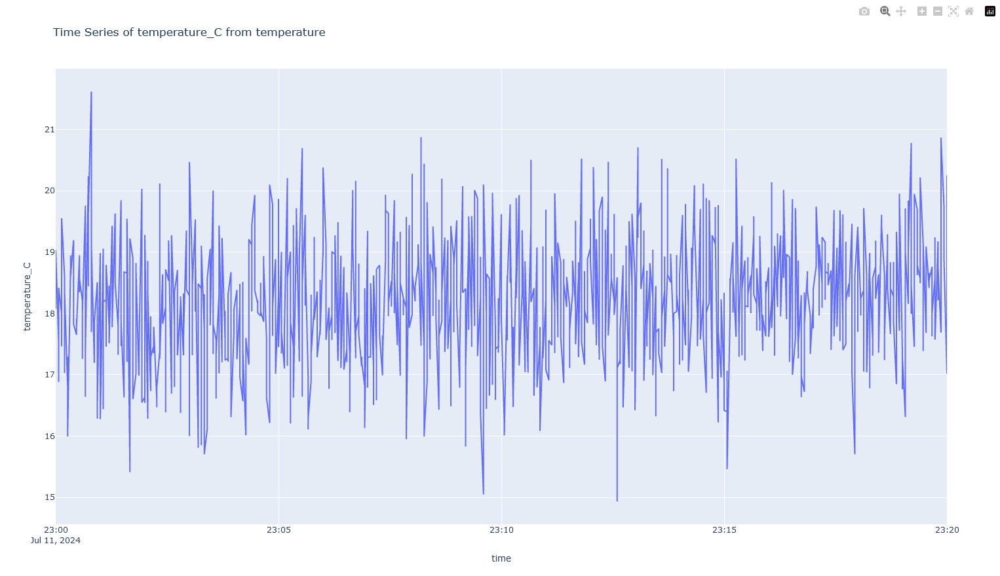

# Teaching Factory


## Table of Contents
- [Overview](#overview)
- [Installation](#installation)
- [Usage](#usage)
  - [convert_time.py](#convert_timepy)
  - [database.py](#databasepy)
  - [database_connection.py](#database_connectionpy)
  - [mqtt_subscribe.py](#mqtt_subscribepy)
  - [save_data_to_csv.py](#save_data_to_csvpy)
  - [user_interface.py](#user_interfacepy)
  - [visualize.py](#visualizepy)
- [Configuration File](#configuration-file)
- [Time Series Data Visualization](#time-series-data-visualization)
- [Streamlit Application](#streamlit-application)
- [Regressionsmodell für Endgewicht](#regressionsmodell-für-endgewicht)
- [Klassifikationsmodell für defekte Flaschen](#klassifikationsmodell-für-defekte-flaschen)
- [License](#license)

## Overview
The Teaching Factory project is an IoT (Internet of Things) initiative aimed at facilitating data processing, storage, and visualization for industrial applications. This project includes a series of Python scripts designed to handle various aspects of data management, including time conversion, database operations, MQTT communication, and data visualization. The project also features a planned Streamlit web application to provide an interactive interface for data visualization.

### Components:
- *Time Conversion*: Scripts to convert time formats between Unix timestamps and readable date strings.
- *Database Management*: Scripts to create database schemas and manage data insertion.
- *MQTT Communication*: Scripts to subscribe to MQTT topics and save incoming messages to the database.
- *Data Storage*: Scripts to save database tables into CSV files for further analysis.
- *User Interface*: Command-line interface to facilitate user interactions.
- *Data Visualization*: Scripts to plot and visualize data using Plotly.
- *Configuration File*: A configuration file (`configuration.ini`) is used to manage the login and MQTT settings, including the MQTT broker address, port, user credentials, and topics to subscribe to.


The project is designed with modularity and scalability in mind, making it easy to integrate additional features and functionalities in the future. The development process involved utilizing various Python libraries and tools to ensure robust and efficient data handling.

## Installation

1. **Clone the Repository**:
    ```bash
    git clone https://github.com/Docterpanzen/Teaching_Factory_IoT
    ```

2. **Change the directory**:
    ```bash
    cd Teaching_Factory_IoT
    ```

3. **Install Dependencies**:
    ```bash
    pip install -r requirements.txt
    ```

## Usage
You can either run the Streamlit application to browse and analyze the data interactively or specify the data and time range you want to visualize and run the Visualization Module.

4. **Run the Streamlit Application**:
    ```bash
    streamlit run user_interface.py
    ```

5. **Run the Visualization Module**:
    ```bash
    python visualize.py
    ```


### convert_time.py
This Python module provides functions to convert between Unix timestamps and readable date strings. It includes functionality to handle user input for conversion and ensure the correct format for timestamps and readable dates.

### database.py
This Python module creates an SQLite database with the necessary tables for the Teaching Factory project. It defines a function to set up the database schema, including tables for recipes, final weight, drop oscillation, ground truth, and dispenser events for red, blue, and green colors, as well as temperature data.

### database_connection.py
This Python module manages saving various types of data to an SQLite database. It defines functions to insert data into different tables including recipes, final weight, drop oscillation, ground truth, and dispenser events for red, blue, and green colors, as well as temperature data.

### mqtt_subscribe.py
This module connects to an MQTT broker, subscribes to various topics related to the teaching factory, and processes the received data to save it into an SQLite database. It utilizes `paho.mqtt.client` for MQTT communication, `json` for parsing the received messages, and a custom `database_connection` module for database operations. The module handles data related to recipes, final weights, drop oscillations, ground truth, dispenser events (for red, blue, and green colors), and temperature. The error management system ensures robust operation by handling connection failures and data parsing errors gracefully, implementing a reconnection mechanism, and providing clear logging messages to facilitate debugging and maintenance.

#### Functions:
- `on_connect(client, userdata, flags, rc, properties=None)`: Connects to the MQTT broker and subscribes to the specified topics.
- `on_message(client, userdata, msg)`: Processes the received messages and saves the data to the database using appropriate functions from the `database_connection` module.

### save_data_to_csv.py
This Python module connects to an SQLite database, extracts data from specified tables, and saves the data as CSV files in a specified directory. It uses sqlite3 for database interaction and pandas for data manipulation and ensures that the data is up-to-date before exporting.

### user_interface.py
This script provides a graphical user interface.

### visualize.py
This Python module connects to an SQLite database, retrieves data from a specified table within a given time range, and visualizes the data as a time series plot. It uses sqlite3 for database interaction, pandas for data manipulation, and plotly.express for plotting, with time conversion utilities provided by the convert_time module.

## Configuration File
The `configuration.ini` file is used to manage the settings for the MQTT connection and login credentials. This configuration file allows for easy adjustment of settings without changing the core code. Below is an example of what the configuration file looks like:

### Example `configuration.ini`
```ini
[login]
user = bobm
password = letmein

[mqtt]
broker_address = 158.180.44.197
port = 1883

[topics]
recipe = iot1/teaching_factory/recipe
final_weight = iot1/teaching_factory/scale/final_weight
drop_oscillation = iot1/teaching_factory/drop_oscillation
ground_truth = iot1/teaching_factory/ground_truth
dispenser_red = iot1/teaching_factory/dispenser_red
dispenser_blue = iot1/teaching_factory/dispenser_blue
dispenser_green = iot1/teaching_factory/dispenser_green
temperature = iot1/teaching_factory/temperature
```


## Time Series Data Visualization

This Module `visualize.py` fetches and visualizes time series data from an SQLite database using Plotly. It includes functions for converting timestamps, querying data, and plotting it in a line chart. Below are example plots for `final_weight` and `temperature` data, demonstrating the script's capability to generate insightful visualizations from the database.

### Final Weight Plot

*Final weight data visualization.*

### Temperature Plot

*Temperature data visualization.*

## Streamlit Application
The Streamlit application `user_interface.py` provides an interface to visualize time series data from an SQLite database. Users can select data types and time ranges to view data in tabular and line chart formats. The application includes error handling for invalid date ranges and uses a loading spinner to simulate data fetching delays.

### Features

- **Date and Time Selection**: Users can select a specific date and time range to fetch data.
- **Data Type Selection**: Users can choose between different data types: Dispenser Data, Final Weight Data, and Temperature Data.
- **Data Fetching**: Fetches data from an SQLite database based on user selection.
- **Data Visualization**: Displays data in a table format and as a line chart using Plotly.
- **Error Handling**: Provides error messages for invalid date ranges and when no data is found.
- **Loading Spinner**: Displays a spinner while data is being fetched.


## Regression Model for Final Weight

The regression model generates two files:

1. **regression_data/reg_52216053-52216046-52216069.csv**: This file contains the predictions of the regression model for the dataset "data_csv/X.csv". The file is stored in the "regression_data" subfolder.
2. **regression_data/bericht_52216053-52216046-52216069.csv**: This file contains the report with the best features, the model formula, and the MSE values for training and testing. This file is also stored in the "regression_data" subfolder.

### Regression Results

| Genutzte Spalten                  | Modell-Typ | MSE-Wert (Training) | MSE-Wert (Test) |
|-----------------------------------|------------|---------------------|-----------------|
| ['vibration-index_blue']          | Linear     | 18.7480610470633    | 16.05618559674557 |

### Feature Importance

| Feature                          | MSE          |
|----------------------------------|--------------|
| temperature_mean_C               | 212.537784   |
| vibration-index_red_vibration    | 136.323459   |
| vibration-index_green_vibration  | 97.971186    |
| vibration-index_blue_vibration   | 127.433203   |
| fill_level_grams_red             | 224.035351   |
| fill_level_grams_green           | 220.570877   |
| fill_level_grams_blue            | 197.309463   |

### Best Features and Model Formula

| best features                       | formula                                                                                    | MSE Training   | MSE Test        |
|-------------------------------------|--------------------------------------------------------------------------------------------|----------------|-----------------|
| ['vibration-index_green_vibration'] | y = 0.1115850021802185 * vibration-index_green_vibration + 17.40137857391989               | 18.7480610470633 | 16.05618559674557 |


## Classification Model for Defective Bottles

The classification model also generates two files:

1. **classification_data/klassifikations_ergebnisse.csv**: This file contains the classification results, including the features used, model types, and F1-scores for training and testing. This file is stored in the "classification_data" subfolder.
2. **classification_data/confusion_matrices.txt**: This file contains the confusion matrices for the various models. It is also stored in the "classification_data" subfolder.

### Classification Results

| used features                             | modell-type      | F1-Score (Training) | F1-Score (Test) |
|-----------------------------------------------|-----------------|---------------------|-----------------|
| ['mean_drop', 'std_drop', 'max_drop', 'min_drop'] | kNN             | 0.5234899328859061  | 0.2857142857142857 |
| ['mean_drop', 'std_drop', 'max_drop', 'min_drop'] | Log. Regression | 0.0                 | 0.0               |

### Confusion Matrices

**kNN**:

|                      | Predicted Negative | Predicted Positive |
|----------------------|--------------------|--------------------|
| **Actual Negative**  | 314                | 0                  |
| **Actual Positive**  | 25                 | 5                  |

**Log. Regression**:

|                      | Predicted Negative | Predicted Positive |
|----------------------|--------------------|--------------------|
| **Actual Negative**  | 314                | 0                  |
| **Actual Positive**  | 30                 | 0                  |


## License

This project is licensed under the terms of the [LICENSE](LICENSE) file.
